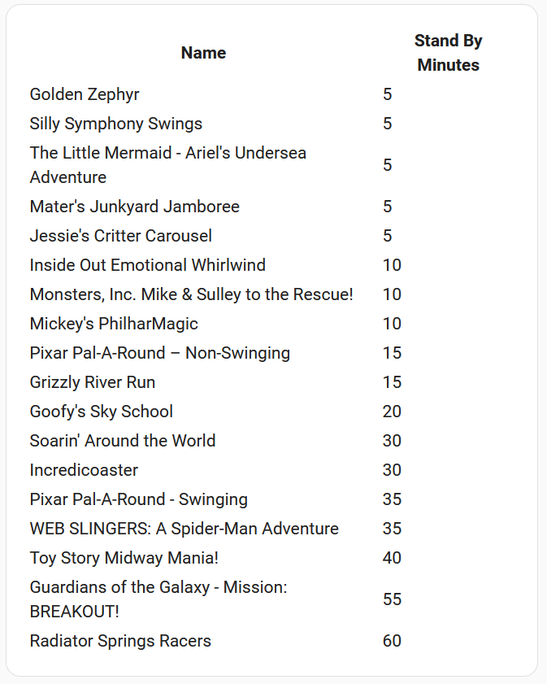

# FAQ

## How do I take full advantage of this integration?

Once you've setup your target theme park, there are a few main components.

1. The [recommended attractions](./entities.md#recommended-attractions) todo list, which keeps track of all the attractions you want to ride. This is a standard todo list which can be managed in the normal way.
2. The [reset recommended attractions](./services.md#reset_remaining_attractions) service which populates the above todo list for the target theme park. Be sure to add the attractions you don't want to include in your visit.
3. The [alert blueprint](./blueprints.md#alert-when-recommended-attraction-or-show-updates), which will alert you what ride/show to go to next and give you the option to remove the attraction so you can be recommended on the next attraction.
4. The [clear recommended attractions](./services.md#clear_remaining_attractions) service, which clears all attractions from the todo list and will effectively stop your alerts.

## I want to see the times in my dashboard for a given theme park. How do I do this?

You can take advantage of the markdown card, and include the following logic

```
| Name | Stand By Minutes |
|------|------------------|
| {{ attraction.name }} | {{ attraction.stand_by_wait_time_in_minutes }} |

```

This will produce the following style

{width=300px}

Be sure to update the target entity for your park.

## How do I increase the logs for the integration?

If you are having issues, it would be helpful to include Home Assistant logs as part of any raised issue. This can be done by following the [instructions](https://www.home-assistant.io/docs/configuration/troubleshooting/#enabling-debug-logging) outlined by Home Assistant.

You should run these logs for about a day and then include the contents in the issue. Please be sure to remove any personal identifiable information from the logs before including them.